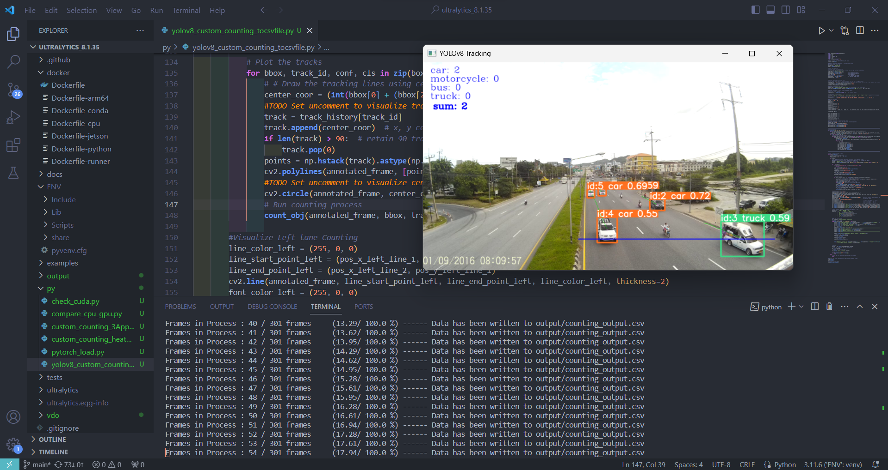
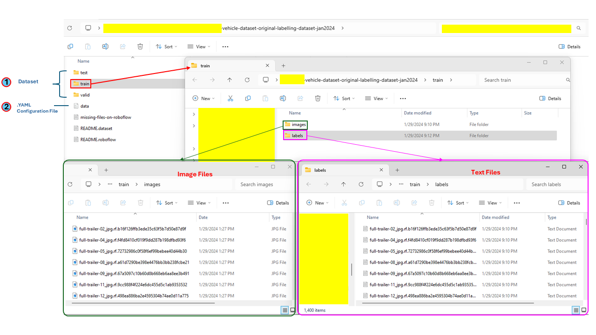
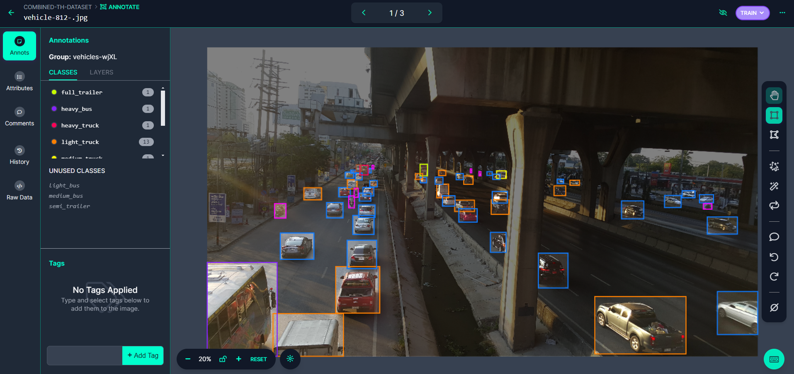
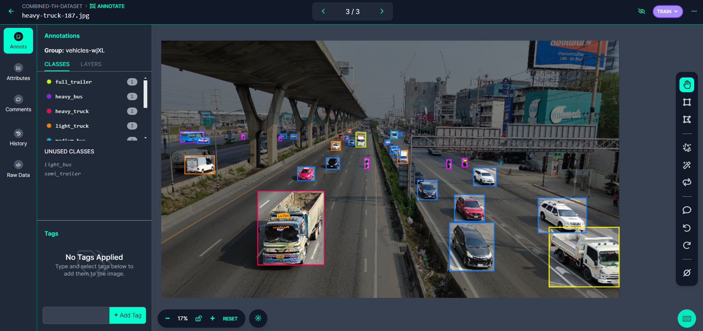
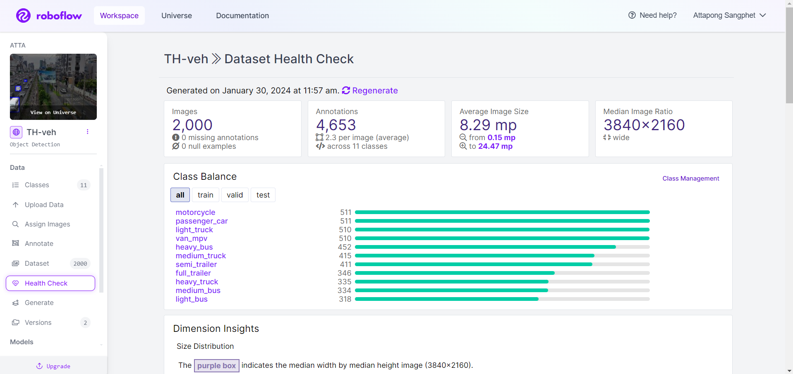
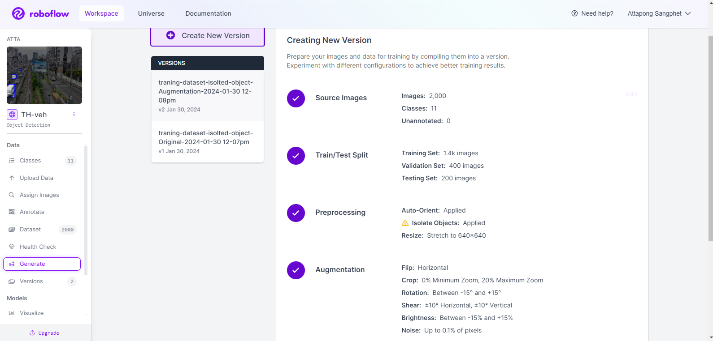
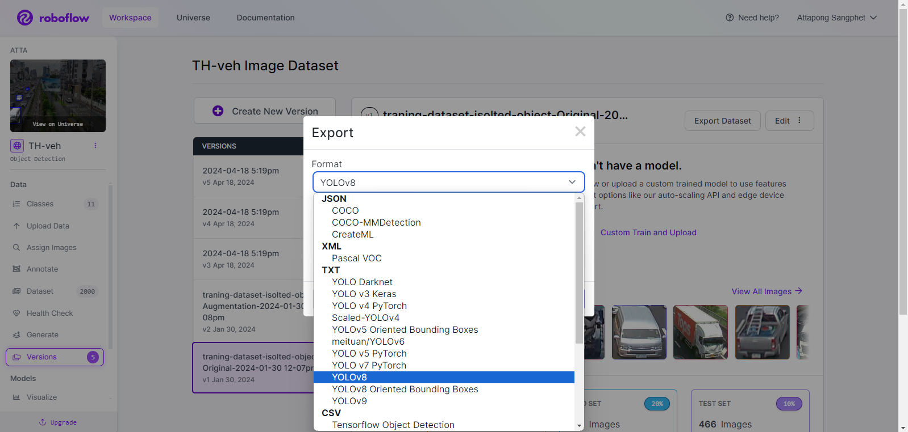
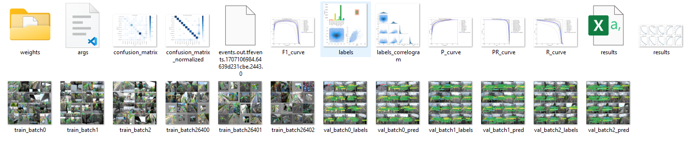

# vehicle-classificataion-and-counting-system
This repository is a simple guidance of counting and classification system for vechicle object using YOLOv8 model, developed by Ultralytics team.
YOLOv8 is one of popular real-time detection and classification tasks and supports multi-object tracking (MOT) algorithms like Bot-SORT and ByteTrack also. This model is very friendly for new users and powerful one.
For counting vehicle objects, YOLOv8 was trained by using COCO128 datasets, so YOLOv8 training wieght, internal parameters, can be used to detect and classify any vehicle classes in COCO128 dataset such as car, motorcycle, bus, and truck easily and accurately. 
But if we want to use it for any custom classes, we need to train our custom training weight first. This model also supports training mode that we can train any custom datasets for some specific object detection and classification.

For the counting method, this system use OpenCV to create a referenced line to count any vehicle object that move through the line.

In this project, I will show how to easily setup process and run counting py file using original weight of YOLOv8 first, and the next step, I will display how to train custom data weight for my specific task, to classify 11 different vehicle classes.

More information about Ultralytics: https://docs.ultralytics.com/

## Getting Started
clone this repo to get .py files for vehicle connting
```sh
git clone https://github.com/Atta-Tan/simple-custom-training-dataset-yolov8-vehicle-counting.git
```
next, create virtual environment and install ultralytics (or clone Ultralytics repo (optional))

```sh
cd ...ROOTPATH.../simple-custom-training-dataset-yolov8-vehicle-counting
python -m venv ENV
pip install Ultralytics
```
Activate virtual environment (as ENV) and install packages

```sh
.\ENV\Scripts\activate
pip install -e .
```

(Optional) In case of need to run with GPU

Re-install pytorch on our machine.
```sh
pip3 uninstall torch torchvision torchaudio
pip3 install torch torchvision torchaudio --index-url https://download.pytorch.org/whl/cu118
```

More information about Pytorch: https://pytorch.org/get-started/locally/

Now our environment is ready!!

## Running counting vehicles (4 classes in COCO128 Dataset)
Setting INPUT_PATH, OUTPUT_PATH, WEIGHT_PATH (eg. yolov8m.pt), and position of coordination x, y of counting line

Run counting .py file

```sh
python ./py_files/yolov8_custom_counting_tocsvfile.py
```


https://github.com/Atta-Tan/simple-custom-training-dataset-yolov8-vehicle-counting/assets/139097897/6592d039-8051-4f9e-8726-6b721c82221e

## Create Custom Dataset
To train a custom weight for other specific classes that are not in any original training datasets of YOLOv8, We have to prepared our own dataset in Ultralytics YOLOv8 format as follows. 
- dataset that consists of image files of objects and text files that collect class id and bounding box of objects (split to train, validation, and test (optional) folders).
- configuration (.yaml) file in that collect paths of dataset (train, val, and test), number of classes, and class names.



In my custom case, I want to train detection and classification model that can classify 11 different vehicle classes on Thailand road. What I have to do is creating custom dataset of all vehicle classes and train it all to get efficient training weight. Thus, I collected traffic images on Thailand urban road in various situations as a raw dataset, and then annotated vehicle object bounding boxes and class names of each vehicle for every images. 

There are many ways to You can create your own dataset, in manual way or using any labeling tools, but using Roboflow framework is recommended for me.

- It is asy to annotate objects to dataset





- Check dataset balance and details



- Generate dataset with Preprocessing and Augmentaion.



- Then, export to YOLOv8 format.



## Training Custom Weight
Train our custom dataset using YOLOv8.

More information about Training with Ultralytics: https://docs.ultralytics.com/modes/train/

Example:

```sh
yolo detect train data=data.yaml model=yolov8n.yaml epochs=NUMBER_OF_EPOCHS imgsz=TARGET_IMAGE_SIZE save=True project=PROJECT_NAME name=EXPERIMENT_NAME
```

After training process, we will get our custom training weight in .pt file (best and last) and experimental result that indicate training performance.



And with this custom weight (best.pt), we are ready to create new model for specific object detection and classification.

## Running vehicle counting for custom task
Setting WEIGHT_PATH with our customweight

And then, try to run counting .py file again.

https://github.com/Atta-Tan/simple-custom-training-dataset-yolov8-vehicle-counting/assets/139097897/1731db32-14ea-434a-9b30-dce8608188c2

https://github.com/Atta-Tan/simple-custom-training-dataset-yolov8-vehicle-counting/assets/139097897/9acbe2b3-61b7-4e31-818a-b1f0221baffd


